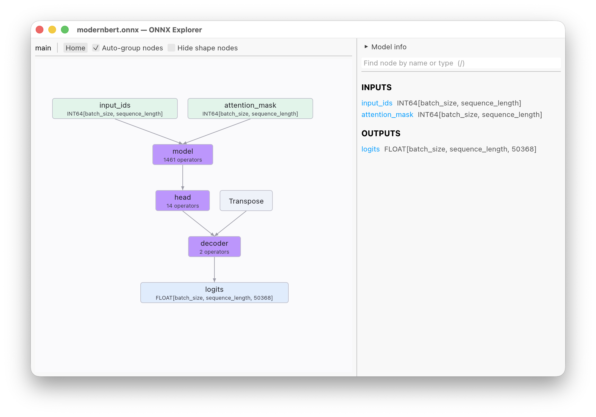

# onnx-explorer

A native app for exploring [ONNX](https://onnx.ai/) model graphs. It is like
[Netron] but much faster at loading large and complex models.



## Features

 - Visually explore an ONNX model and inspect the attributes of nodes
 - Loads large models very quickly
 - Groups nodes into semantic blocks (embedding, head, normalization, attention
   etc.) using information in node names
 - Shows statistics and distribution of constant values

## Building

Install the current version of [Rust](https://rust-lang.org/) and cargo, then
build the project with:

```sh
cargo build --release
```

This writes the binary to `target/release/onnx-explorer`. To install it onto
your path instead:

```sh
cargo install --path .
```

## Usage

```sh
onnx-explorer model.onnx
```

## AI development disclaimer

This project was vibe-coded with Claude Code. The author has not read most of
the code.

[Netron]: https://github.com/lutzroeder/netron
